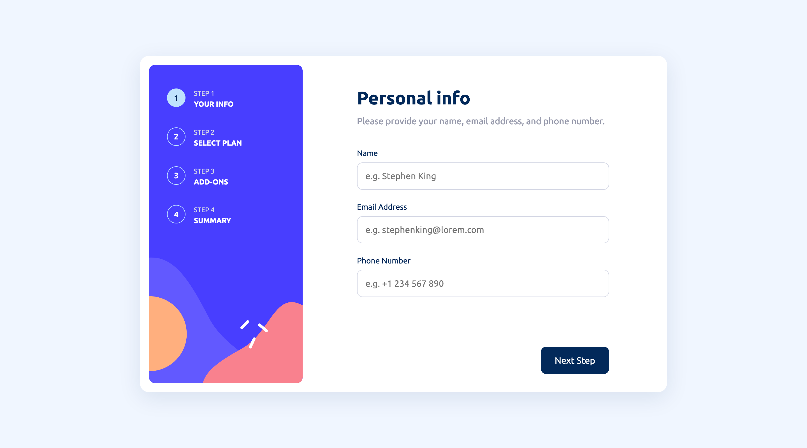
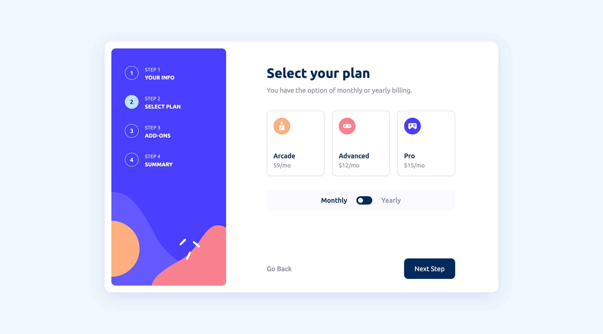
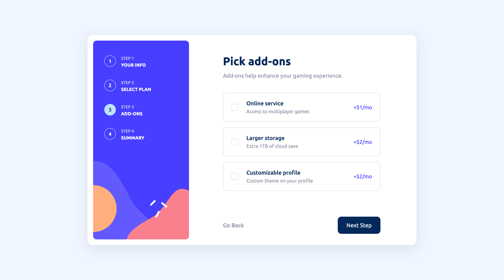
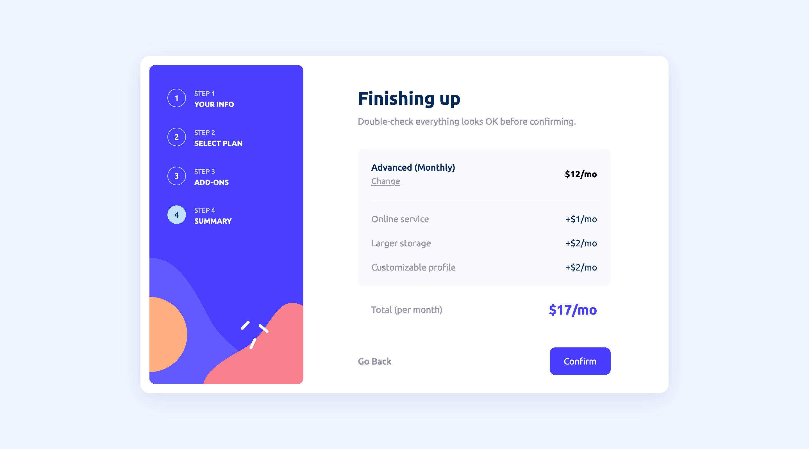
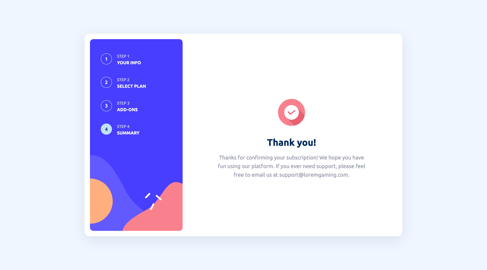

# Frontend Mentor - Multi-step form solution

This is a solution to the [Multi-step form challenge on Frontend Mentor](https://www.frontendmentor.io/challenges/multistep-form-YVAnSdqQBJ).

## Table of contents

- [Overview](#overview)
  - [The challenge](#the-challenge)
  - [Screenshots](#screenshots)
  - [Links](#links)
- [Process](#process)
  - [Built with](#built-with)

## Overview

### The challenge

Users should be able to:

- Complete each step of the sequence
- See a summary of their selections on the final step and confirm their order
- View the optimal layout for the interface depending on their device's screen size
- See hover and focus states for all interactive elements on the page

### Screenshots

|                                  |                                  |                                  |
| -------------------------------- | -------------------------------- | -------------------------------- |
| Step 1  | Step 2  | Step 3  |
| Step 4  | Step 5  |                                  |

### Links

- Live Site URL: [Vercel](https://multistep-form-ayakh99.vercel.app/)

## Process

### Built with

- Next.js
- React
- Redux
- React Hook Form
- CSS Modules
